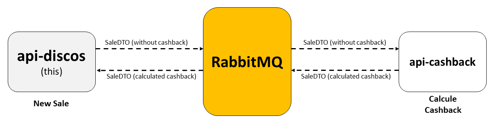

# Desafio Beblue - Engenheiro Back-end

Desafio para ingresso como desenvolvedor back-end no Beblue: API REST para uma loja de discos de vinil que resolveu oferecer cashback em suas vendas.



### Tecnologias
- [Docker](https://www.docker.com/)
- [Gradle](https://gradle.org/)
- [Spring Boot](https://spring.io/projects/spring-boot)
- [Spring Data JPA](https://spring.io/projects/spring-data-jpa)
- [H2 Database Engine](https://www.h2database.com/) (database)
- [Lombok](https://projectlombok.org/)
- [JUnit](https://junit.org/junit5/)
- [AssertJ](https://joel-costigliola.github.io/assertj/)
- [Mockito](https://site.mockito.org/)
- [RabbitMQ](https://www.rabbitmq.com/)

## Instruções de execução

Esta aplicação simula a integração entre microsserviços utilizando RESTful e mensageria, 
portanto para execução se faz necessário o uso de um container do RabbitMQ.

### Clone
```https://github.com/henriqueneves/api-discos-beblue.git```

### Execução

RabbitMQ

```
docker run -d --rm --hostname test-rabbit --name test-rabbit -p 15672:15672 -p 5672:5672 rabbitmq:3-management
```

Aplicação

```
Em breve
```

## Documentação

### Discos
* Importação: realizada automaticamente.

* Inserir disco: persiste um novo disco.
  * Content-Type: application/json
  * POST: [http://localhost:8080/discs](http://localhost:8080/discs)
  * Exemplo BODY - RAW:
  ```
  {
    "name": "Disco personalizado",
    "genre": "ROCK",
    "price": 42.42
  }
  ```
  
* Editar disco: edita um disco existente.
  * Content-Type: application/json
  * PUT: [http://localhost:8080/discs](http://localhost:8080/discs)
  * Exemplo BODY - RAW:
  ```
  {
    "id": 201,
    "name": "Disco personalizado",
    "genre": "ROCK",
    "price": 42.42
  }
  ```
  
* Deletar disco: remove um disco existente.
  * Content-Type: application/json
  * DELETE: [http://localhost:8080/discs/**10**](http://localhost:8080/discs/10)
  * Exemplo BODY - RAW: null
  
* Buscar disco por identificador
   * Content-Type: application/json
   * GET: [http://localhost:8080/api/discs/**5**](http://localhost:8080/discs/5)


* Busca paginada: retorna N discos de determinado gênero utilizando filtros
  * Content-Type: application/json
  * Parâmetros opcionais: page, size (max = 1000)
  * GET: [http://localhost:8080/discs/search/**ROCK**?page=**1**&size=**10**](http://localhost:8080/discs/search/ROCK?page=1&size=10)

### Vendas

* Criar venda: persiste uma nova venda.
  * Content-Type: application/json
  * POST: [http://localhost:8080/sales](http://localhost:8080/sales)
  * Exemplo BODY - RAW:
  ```
  {
    "discsID": [ 11, 22, 32 ]
  }
  ```
  
* Deletar venda: remove uma venda existente.
  * Content-Type: application/json
  * DELETE: [http://localhost:8080/sales/**10**](http://localhost:8080/sales/10)
  * Exemplo BODY - RAW: null
  
* Buscar venda por identificador
   * Content-Type: application/json
   * GET: [http://localhost:8080/api/sales/**5**](http://localhost:8080/sales/5)


* Busca paginada: retorna N vendas filtrando por data
  * Content-Type: application/json
  * Parâmetros opcionais: page, size (max = 1000)
  * GET: [http://localhost:8080/discs/search/**ROCK**?page=**1**&size=**10**](http://localhost:8080/discs/search/ROCK?page=1&size=10)

### Cashback
Serviço simulado: as mensagens de vendas são recebidas pelo RabbitMQ e o 
envio das respostas é feito manualmente, simulando a resposta de um terceiro.

* Simular cálculo do Cashback
  * No RabbitMQ, localizar a queue **cashback-calculated**
  * Publicar nova mensagem em **Publish message**.
  * Exemplo Payload:
  ```
  {
      "idSale": 1,
      "discs": [
          {
              "idDiscSale": 1,
              "cashbackValue": 12.50
          },
  		{
              "idDiscSale": 2,
              "cashbackValue": 5.30
          },
          {
              "idDiscSale": 3,
              "cashbackValue": 11.30
          }
      ],
      "cashbackTotal": 29.10
  }
  ```
  

## Observações:

* Para testar a API recomenda-se o uso de um API Client (Postman).
* Para facilitar os testes, o banco de dados é criado automaticamente.
* A API não exige autenticação para acesso as suas funcionalidades.
